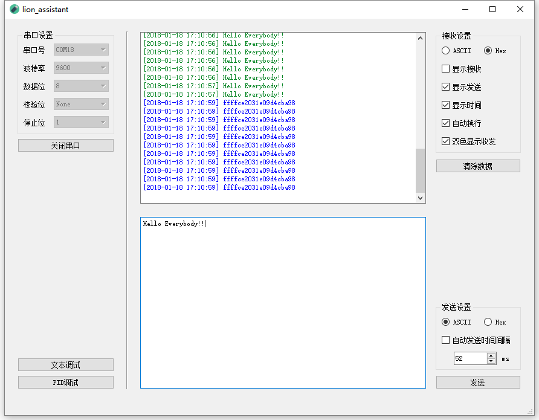
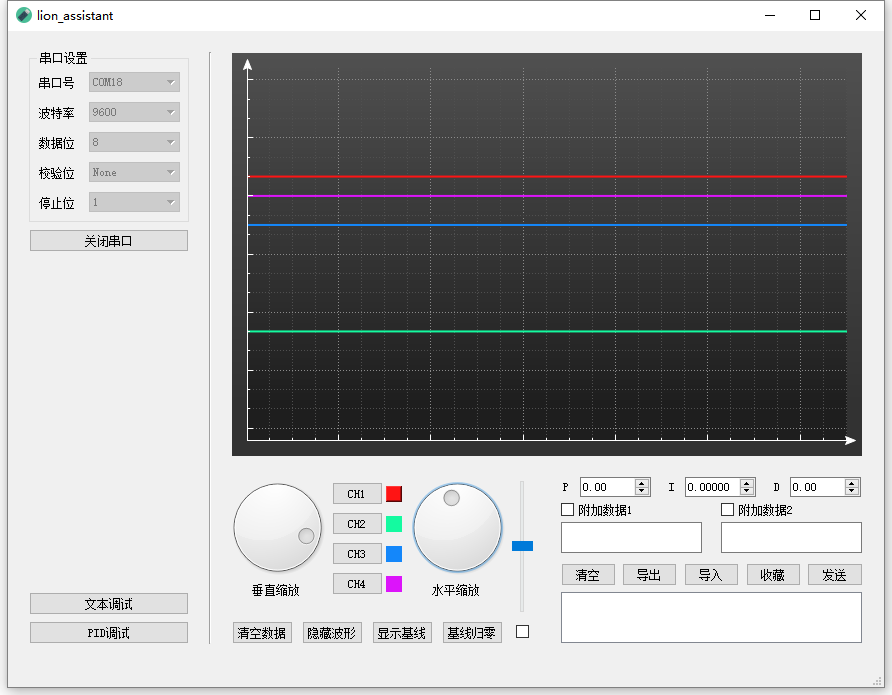

# Lion Assistant
一款队内使用的多功能串口助手

## 下载链接

```
链接：https://pan.baidu.com/s/1c2MzpVM 
密码：54h0
```

## 版本迭代

### v1.2.2 Beta
PID参数收藏栏加入清空、导出和导入

#### 文本调试
1. 限制了自动发送的时间间隔，现在限制为5~10000ms
2. 修复了关闭串口时还在自动发送信息的问题
3. 去除了大部分状态栏信息显示

#### PID调试
1. PID调试界面PID参数收藏栏部分加入清空、导出、导入三个部分，方便实际操作时对已收藏的PID参数进一步处理
2. 现在没有打开串口之前[发送]按钮不可用了
3. 修正了双击PID参数收藏栏条目但opt1和opt2的可选框没有随之更新的问题
4. 现在勾选文本调试界面的`显示发送`后也可以显示已发送的PID数据了

#### 示波器设置
1. 修正了当水平缩放为最小倍数时波形不会铺满整个示波器画面的问题


### v1.1.2 Beta
Bug修复和稳定性增强。

#### 串口设置
1. 修复了打开串口时软件崩溃的问题
2. 调整了`校验位`下拉框项目的名词，由原本的`无校验`、`奇校验`、`偶校验`、`空校验`、`标记校验`分别改为`None`、`Odd`、`Even`、`Space`、`Mark`
3. 在代码层面对 _**ByteArray**_ 转 _**double**_ 用到的函数（原为`byteArr2d`，现改为`ba2d`并加入类成员）和`~lion_assistant`函数进行了改进，增强其稳定性

### v1.1.1 Beta
Bug修复

#### 文本调试
1. 修复了修改自动发送间隔时间后不会立刻生效的问题

#### 示波器设置
1. 修复了Channel时点击Ch3和Ch4按钮不会取消全选的问题
2. 修复了无数据时调整示波器垂直/水平缩放无现象的问题

### v1.1.0 Beta
Bug修复累计更新，同时引入了一些新特性。

#### 串口设置
1. 修复了原本串口列表不会自动更新的Bug，实现办法是1s定时扫描，扫描时会导致界面卡顿，alpha测试中遇到过一次崩溃情况但暂时无法复现

#### 文本调试
1. 修复了自动发送可选框取消勾选后不会停下发送的问题
2. 修改了文本调试界面发送信息的颜色，现在改为更暗的绿色，没有之前那么刺眼了

#### 示波器设置
1. 在`竖向滑条`下加入了`可选框`，现在`竖向滑条`可以选择对所有波形进行垂直平移了
2. 当勾选竖向滑条下的`可选框`时，`显示/隐藏波形`、`显示/隐藏基线`和`基线归零`也同样可对所有Channel有效了
3. 修改了示波器数据的传输协议，现在的计算公式是 `传输数据 = 原始数据 * 10 + 32768`，所以支持负数和1位精度（向下取整）的浮点数了
4. 示波器垂直缩放倍数调整为原本的10倍，实际显示范围调整为[-3277.0, 3277.0]
5. 减小了最大数据量限制，一定程度上缓解示波器卡顿状况
6. 修复了初开程序时示波器缩放不正确的问题
7. 现在单击`收藏栏`中的`PID记录`可以将其复制到剪贴板了


### v1.0.0 Beta

#### 总述
1. 大部分功能已就绪
2. 软件仅在各功能局部进行测试，尚未经过大量测试，不确定稳定性
3. 已知当数据量较大时界面会卡顿，数据量和流量特别大时有可能会卡死，将在后续版本尽可能修复


## 开发目的

1. PID参数整定流程优化
2. 支持Windows、MacOS和Linux平台以便于在个人电脑和嵌入式Linux上同时使用


## 开发环境

- Qt 5.10.0
- QT Creator 4.5.0
- MinGW 5.3.0


## 软件架构

### 1. 串口设置

1.1. 端口号
- 自动探测端口号并置入可选框

1.1. 波特率
- 支持标准波特率1200、2400、4800、9600、19200、38400、57600、115200

1.1. 数据位
- 支持5、6、7、8位

1.1.4. 校验位
- 支持无校验(None)、奇校验(Odd)、偶校验(Even)、空校验(Space, 始终为0)、标记校验(Mark, 始终为1)

1.1.5. 停止位
- 支持1、1.5、2位


### 2. 文本收发界面



分为数据接收显示区（左上）、数据发送编辑区（左下）和设置区（右），设置区可对接收和发送参数进行设置。


#### 设置区选项

1. 接收设置
   1. 字符默认以`ASCII`编码显示，可选`Hex`（16进制编码）显示
   2. 默认不显示已接收信息，勾选`显示接收`后开始已接收显示信息
   3. 可选择显示已发送信息，勾选`显示发送`后开始显示已发送信息
   4. 勾选`显示时间`可选择在每条信息前加入信息时间戳
   5. 勾选`双色显示收发`可用颜色区分已接收/已发送信息，对应颜色分别是蓝、绿
2. `清除数据`按钮用于清除数据接收显示区已显示的信息
3. 发送设置
   1. 字符默认以`ASCII`编码显示，可选`Hex`（十六进制编码）显示
   2. 勾选`自动发送时间间隔`并设置时间间隔可自动发送上一次发送的指令
4. 点击`发送`按钮将数据发送编辑区的信息通过串口发送到其他设备


### 3. PID设置界面



分为虚拟示波器（上方）、示波器设置区（左下）和PID参数设置区（右下）


#### 示波器设置区选项

1. 转动`垂直缩放`旋钮可对示波器Y轴进行缩放，缩放范围为0.01~10倍
2. 转动`水平缩放`旋钮可对示波器X轴进行缩放，缩放范围为0.01~1倍，当接收数据量大于当前界面显示数据量时，显示窗口将自动滑动以保持显示最新波形
3. 示波器最大支持4路信息同时显示，点击`CH1`、`CH2`、`CH3`、`CH4`按钮可选择对应的频道做进一步操作；默认选中`CH1`，当按下某一个按钮时，右方的色块出现阴影以表示选中；右方色块同时也是对应波形的颜色
4. 点击`清空数据`按钮将清空4路频道的所有信息
5. 点击`基线归零`按钮将重置当前选中频道的参考线为居中
6. 点击`显示/隐藏波形`按钮将显示或隐藏当前选中频道的数据波形图（但不影响原本参考线的显示）
7. 点击`显示/隐藏基线`按钮将显示或隐藏当前选中频道的基准线（不影响波形显示），基准线颜色同当前选中频道的数据波形颜色
8. 拖动右侧`竖向滑条`可垂直平移当前选中频道数据波形和参考线在示波器中的位置以在某些情况下方便观察
9. 勾选`竖向滑条`下方的可选框可全选所有Channel，取消勾选则回到上一次选择的Channel；若在勾选后选择了一个新Channel则将自动取消勾选


#### PID参数设置区

1. P、I、D三个参数要求输入正 _**double**_ 类型数据，暂不支持负值，点击上下箭头的修改步长为1
2. `附加数据1`和`附加数据2`两个输入框用于某些特定场景下的参数设置，比如需要键入负数、设定角度值和速度值等，只有已勾选的输入框会被加到信息发送队列；在某些情况下，也可以通过这两个输入框作为串口文本通信的发送端（但目前不会显示到`文本调试`的`数据接收显示区`中）
3. 按下`发送`按钮将通过串口向其他设备发送PID和附加数据文本
4. 当有效果不错的PID参数，可按下`记录`将参数记录到下方的`收藏栏`中，但注意目前收藏栏在关闭软件后会清空，如果参数得以确定，请直接写入嵌入式设备或用其他方式记录下来
5. `收藏栏`中的项目是可以双击的，双击将以选中的项目参数更新到设置区（双击项目将覆盖当前参数，请注意保存）
6. `收藏栏`中的项目现在可以单击了，单击将复制选中的项目到剪切板（多次单击同一项目只会复制一次，显示复制时间为首次点击的时间）
7. `清空`按钮将会清空`收藏栏`中的所有项目，如果没有备份，将无法恢复
8. `导出`按钮可以将`收藏栏`中给的所有项目导出为 _.txt_ 文件
9. `导入`按钮可以将指定文件中的可用内容导入到`收藏栏`，可用内容应遵循如下规则

- 忽略所有空格
- `P=`引导p的参数值，`I=`引导i的参数值，`D=`引导d的参数值，`opt1=`引导opt1的参数值，`opt2=`引导opt2的参数值，以换行为结尾，换行符前允许有英文分号`;`
- 两组参数值之间用至少4个`-`隔开
- 有效数据最后要至少多留一行空行

三个可行的例子如下

```
P = 1
I = 0.01
D = 100
opt1 = a100a
opt2 = s100s
Comment:
This is an example.

----

P = 1
opt2 = s200s
Comment:
2018-01-18 17:20:41

------

I = 0.02;

```


#### 数据传输协议

1. 示波器数据接收协议
   1. 以16进制进行接收
   2. 包头为两个`FF`，接下来每两个字节作为一个数据，高字节在前、低字节在后，一帧数据长度共计为10个字节，每两个字节代表数据的计算方法是：`发送数据 = (float)原始数据 × 10 + 32768`
   3. 例子：`... FF FF 11 11 22 22 33 33 88 88 ...`为一个数据帧，其中携带的四个数据分别为0x1111、0x2222、0x3333、0x8888，则其对应的分别是-2839.9、-2403.0、-1966.1、219.4。
   4. 显示区域的数据范围原则上为[-3277, 3277]，但由于设计倾向于定性分析而忽视Y轴示数，且加入了波形位移功能，所以其他设备在拼接数据包时只要保证发送的数据非负，然后调整示波器得到波形即可。
2. PID参数发送协议
   1. 以ASCII进行发送
   2. 无包头，各参数发送格式如下，可单独发送也可拼接发送，无规定包长

    | 参数项目 |   发送格式    |   例子   |
    | :--: | :-------: | :----: |
    |  P   | p{value}p |  p10p  |
    |  I   | i{value}i | i0.01i |
    |  D   | d{value}d | d999d  |
    | 设定角度 | a{value}a | a180a  |
    | 设定速度 | s{value}s | s1000s |